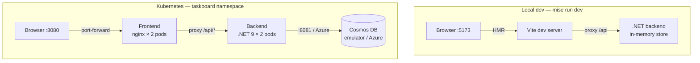

# TaskBoard

A task board SaaS built on the same stack used in production-grade .NET + React + Azure platforms. Projects are organised into Kanban columns (To Do, In Progress, Done) backed by Azure Cosmos DB, deployed on Kubernetes, and managed entirely through `mise`.

---

## System Architecture



---

## Stack

### Backend — .NET 9 / C#

**Key decisions:**
- **Minimal APIs** over MVC controllers — less ceremony, faster cold start, easier to read
- **`IRepository` interface** with two implementations (`InMemoryRepository`, `CosmosRepository`) — lets you swap the data layer via config rather than code, no Docker required for fast local iteration
- **Retry loop on startup** — Cosmos DB takes ~30s to become ready in k8s; the backend retries for up to 100s before failing rather than crashing immediately
- **`LimitToEndpoint = true`** — the Cosmos DB vnext emulator advertises `127.0.0.1` in its metadata response; this flag tells the SDK to ignore discovered endpoints and always use the one in the connection string (critical for k8s where `127.0.0.1` resolves to the pod itself)

### Frontend — React 19 + TypeScript

**Key decisions:**
- **Vite** for dev tooling — near-instant HMR, no webpack config debt
- **Typed API client** (`src/api/client.ts`) — a single typed fetch wrapper means the entire API surface is visible in one place; no SDK or codegen needed at this scale
- **nginx in production** — the frontend container serves static assets and proxies `/api/*` to `http://taskboard-backend` (the k8s service). This means the browser only ever talks to one origin, no CORS config needed, and no ingress controller is required for local k8s
- **Drag-and-drop** — native HTML5 drag events move tasks freely between any column; no extra dependencies, optimistic updates with rollback on failure

### Database — Azure Cosmos DB

**Schema:**
- Container `projects` — partition key `/id`
- Container `tasks` — partition key `/projectId` (collocates all tasks for a project on the same partition, making task queries single-partition reads)

**Local development options:**
| Mode | Store | Command | Use when |
|------|-------|---------|----------|
| In-memory | `InMemoryRepository` | `mise run dev` | Fast UI iteration, no infra needed |
| Emulator | `CosmosRepository` → vnext emulator pod | `mise run k8s:deploy` | Testing Cosmos-specific behaviour (queries, partitioning, throughput) |
| Production | `CosmosRepository` → Azure Cosmos DB | `mise run infra:up` | Real workloads |

### Kubernetes

**Key decisions:**
- **2 replicas for backend and frontend** — mirrors production redundancy even locally; Cosmos DB emulator stays at 1 (not clustered)
- **`imagePullPolicy: IfNotPresent`** — uses locally built images; change to `Always` when pulling from a remote registry
- **Cosmos DB as a pod** — the vnext emulator (`mcr.microsoft.com/cosmosdb/linux/azure-cosmos-emulator:vnext-preview`) runs in the cluster alongside the app. The `vnext-preview` tag is used because the default `latest` image lacks an arm64 manifest
- **Frontend nginx proxies `/api`** — eliminates the need for an ingress controller in local k8s. In production, replace with an ingress or Azure Front Door
- **ConfigMap / Secret separation** — `UseInMemoryStore`, `CosmosDb__DatabaseName`, and `CosmosDb__DisableSslVerification` are non-sensitive config; the connection string is a Secret. Flip `UseInMemoryStore` to `"false"` and populate the secret for production Cosmos DB

### Tool Management — mise

**Runtime versions:**
```toml
[tools]
node = "22"
dotnet = "9"
azure-cli = "latest"
kubeconform = "latest"
kube-linter = "latest"
```

**Environment variables** can be set per-project in `.mise.toml` and are activated automatically when you enter the directory:
```toml
[env]
ASPNETCORE_ENVIRONMENT = "Development"
NODE_ENV = "development"
```

For secrets and per-machine overrides, mise can load a `.env` file (add it to `.gitignore`):
```toml
[env]
_.file = ".env"
```

This means a new contributor runs exactly two commands — `mise install` then `mise run dev` — and gets the right Node version, the right .NET version, the right environment variables, and all services started.

---

## Project Structure

```
taskboard/
├── mise.toml                  # Tool versions (node, dotnet) + all tasks + env config
├── backend/
│   ├── TaskBoard.Api.csproj
│   ├── Program.cs             # Minimal API endpoints + DI wiring
│   ├── Models/                # Project, TaskItem, TaskStatusUpdate
│   ├── Repositories/
│   │   ├── IRepository.cs
│   │   ├── InMemoryRepository.cs
│   │   └── CosmosRepository.cs
│   ├── appsettings.json
│   └── appsettings.Development.json   # UseInMemoryStore: true
├── backend.Tests/
│   ├── TaskBoard.Api.Tests.csproj
│   ├── InMemoryRepositoryTests.cs     # Unit tests for the in-memory store
│   ├── ProjectsApiTests.cs            # Integration tests — /api/projects
│   └── TasksApiTests.cs               # Integration tests — /api/projects/:id/tasks
├── frontend/
│   ├── src/
│   │   ├── api/client.ts      # Typed fetch wrapper
│   │   ├── components/        # ProjectList, TaskBoard, TaskCard
│   │   ├── __tests__/         # Vitest + Testing Library tests
│   │   └── App.tsx
│   ├── nginx.conf             # SPA fallback + /api proxy + no-cache for index.html
│   ├── Dockerfile
│   └── vite.config.ts         # /api → :5000 proxy for local dev + Vitest config
├── backend/Dockerfile
└── k8s/
    ├── namespace.yaml
    ├── configmap.yaml         # App config (flip UseInMemoryStore for prod)
    ├── secret.yaml            # Cosmos DB connection string
    ├── cosmosdb.yaml          # Emulator deployment (local dev only)
    ├── backend.yaml           # Deployment × 2 + Service
    └── frontend.yaml          # Deployment × 2 + Service
```

---

## Quick Start

### Prerequisites

- [mise](https://mise.jdx.dev) — `curl https://mise.run | sh`
- A local Kubernetes cluster (e.g. [OrbStack](https://orbstack.dev), [Docker Desktop](https://docs.docker.com/desktop/kubernetes/), or [kind](https://kind.sigs.k8s.io)) for k8s tasks

### 1. Install tools and dependencies

```sh
mise install            # installs all tools and runs npm ci via postinstall hook
```

### 2a. Local dev — in-memory, instant startup

```sh
mise run dev
```

- Backend → `http://localhost:5000` (in-memory store, no Cosmos needed)
- Frontend → `http://localhost:5173` (Vite with `/api` proxy)

Data is lost on restart. Use this for day-to-day UI development.

### 2b. Full stack — Cosmos DB in Kubernetes

```sh
mise run k8s:up         # builds images, deploys, force-restarts pods, port-forwards
```

First deploy pulls the Cosmos DB emulator image (~1 GB) — allow 2–3 minutes.

### 3. Run tests

```sh
# Backend (xUnit)
cd backend.Tests && dotnet test

# Frontend (Vitest)
cd frontend && npm test
```

### Task reference

| Task | Description |
|------|-------------|
| `mise run dev` | In-memory backend + Vite frontend |
| `mise run backend` | Backend only (in-memory) |
| `mise run frontend` | Frontend Vite server only |
| `mise run k8s:up` | Build images, redeploy, port-forward to localhost:8080 |
| `mise run k8s:deploy` | Build images + full k8s deploy (no port-forward) |
| `mise run k8s:open` | Port-forward only (no rebuild) |
| `mise run k8s:status` | Show pods / services |
| `mise run k8s:logs` | Tail backend logs |
| `mise run k8s:restart` | Rolling restart of backend + frontend |
| `mise run k8s:teardown` | Delete all k8s resources |

---

## Production Deployment (Azure Container Apps)

Infrastructure is defined in `infra/main.bicep` and provisioned via `mise run infra:up`.

| Component | Azure service |
|-----------|--------------|
| Compute | Azure Container Apps (consumption plan — scales to zero) |
| Database | Azure Cosmos DB serverless |
| Container registry | GitHub Container Registry (GHCR) |
| TLS / ingress | Managed by Container Apps (automatic cert) |

### Steps

**1. Authenticate and provision**

```sh
az login
mise run infra:up        # creates resource group, Cosmos DB, Container Apps (~3 min)
```

**2. Configure GitHub Actions secrets**

Create an Azure service principal and store its credentials as GitHub secrets:

```sh
RG=taskboard-rg
SUB=$(az account show --query id -o tsv)

az ad sp create-for-rbac \
  --name "taskboard-github-actions" \
  --role contributor \
  --scopes "/subscriptions/$SUB/resourceGroups/$RG" \
  --sdk-auth | gh secret set AZURE_CREDENTIALS

gh secret set GHCR_TOKEN   # paste a GitHub PAT with read:packages
```

**3. Deploy**

Images are pushed to GHCR automatically by the CD workflow on every merge to `main`. Trigger a manual deploy via:

```sh
gh workflow run cd-deploy.yml
```

Or update a specific tag directly:

```sh
IMAGE_TAG=abc1234 mise run infra:deploy
```

---

## API Reference

| Method | Path | Description |
|--------|------|-------------|
| `GET` | `/api/projects` | List all projects |
| `POST` | `/api/projects` | Create a project |
| `PATCH` | `/api/projects/:id` | Update project name / description |
| `DELETE` | `/api/projects/:id` | Delete a project (cascades tasks) |
| `GET` | `/api/projects/:id/tasks` | List tasks for a project |
| `POST` | `/api/projects/:id/tasks` | Create a task |
| `PATCH` | `/api/projects/:id/tasks/:taskId` | Update task status |
| `DELETE` | `/api/projects/:id/tasks/:taskId` | Delete a task |

Task status values: `todo` → `in-progress` → `done`
